每周小聚：{.text-3xl}

# [VS Code 与 C 语言开发环境]{.text-5xl}

<a fixed right-6 bottom-4 flex items-center gap-2 font-serif op-80 class="border-none! color-white!" href="https://lug.ustc.edu.cn" target="_blank" rel="noopener noreferrer">

USTCLUG
</a>

---

# Content {.text-center.mt-4.text-4xl!}

<div flex flex-col gap-4 text-2xl mt-10 text-center>

Part 1: VS Code 的基础概念与使用技巧

Part 2: 在 VS Code 中配置 C 语言开发环境

Part 3: 自由讨论，解决配置过程中碰到的各种问题

</div>

---
layout: section
zoom: 0.6
---

# Part 1: VS Code 基础

---

# VS Code: An IDE

不仅仅是代码编辑器，更是集成了调试、版本控制等功能的开发环境

<div py-2 text-xl>

下载安装地址：<span text-2xl font-bold mb-4 border="b-1.5px solid blue-500" w-fit text-blue-500>
https://code.visualstudio.com/
</span>

</div>

- 开源&emsp; [（GitHub 上最活跃的开源项目之一）]{.text-sm.op-80}

- 跨平台 [（这很重要！）]{.text-sm.op-80}

- 轻量级 [（相对而言）]{.text-sm.op-80}

- 可扩展 [（虽说有一堆内部 API）]{.text-sm.op-80}

---

# VS Code Distributions

各种各样的 VS Code

<div h-10 />


<div absolute right-12 top-18 mt-12>

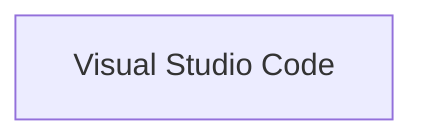

</div>

---

<div mt--8 />

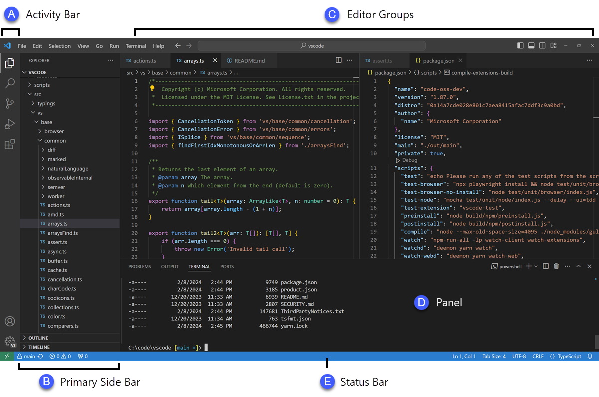{.block.h-95.ml--8}

<div v-drag="[611,49,173,NaN]">

A: 活动栏<span block op-80 text-sm> 各种功能入口 </span>

B: (主)侧边栏<span block op-80 text-sm> 文件管理、搜索等功能 </span>

C: 编辑器区域<span block op-80 text-sm> 代码编辑区 </span>

D: 面板<span block op-80 text-sm> 终端、输出、调试等 </span>

E: 状态栏<span block op-80 text-sm> 当前文件信息、Git 状态等 </span>

</div>

---

# VS Code Extensions <codicon-extensions-large />

VS Code 的强大之处之一

<div />

- **工作台扩展**：添加新的视图、面板等
- **语言扩展**/**调试器**：提供某种编程语言的开发环境
- **主题**/**语言包**/**代码片段**/**键盘映射**
- **AI 拓展**：Agents、MCP
- **拓展包**

<div op-80 mt-8>
(甚至 VS Code 的许多内置也是通过扩展实现的。)
</div>

---

<div fixed inset-0 flex justify-center class="bg-#1B1B1B">
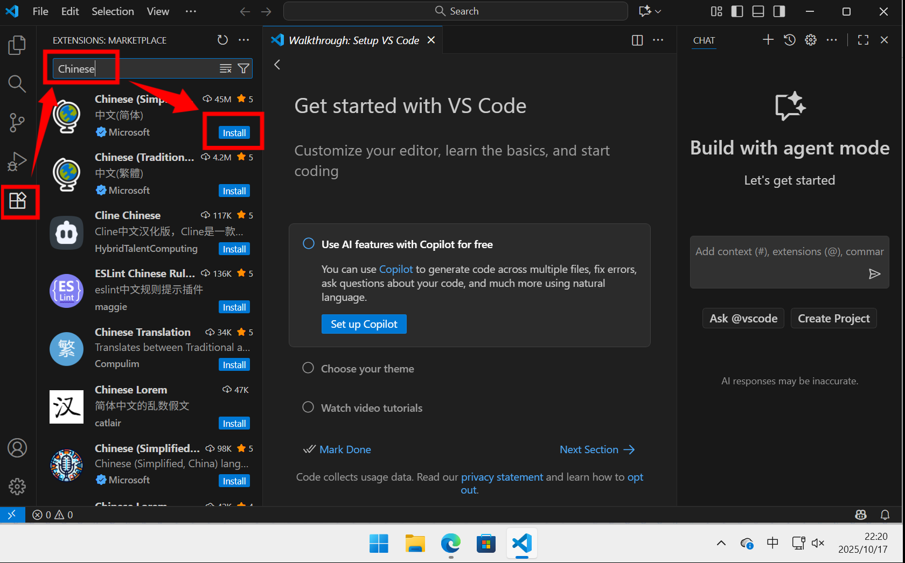
</div>

---

# VS Code 的工作区 (Workspace)

<div />

- 和记事本不同，VS Code 的许多功能依赖于具体的项目

- **工作区 [≈]{.text-2xl.mx-2px} 项目文件夹 [≈]{.text-2xl.mx-2px} VS Code 窗口**

- **[.vscode]{.font-mono} 文件夹**：存储当前工作区的设置、调试配置等


<div op-100>

- 一个工作区可包含多个文件夹

</div>

<div text-center mt-12 text-xl font-bold>

单独在 VS Code 中打开一个文件不会创建工作区，许多功能将不可用

</div>

---

# 如何打开一个文件夹/工作区？

<div />

A. **右键文件夹，选择 “通过 Code 打开”**
  <div flex ml--10>
  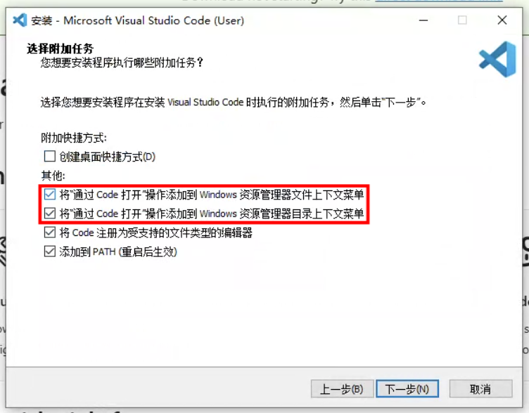
  <div mr--24 />
  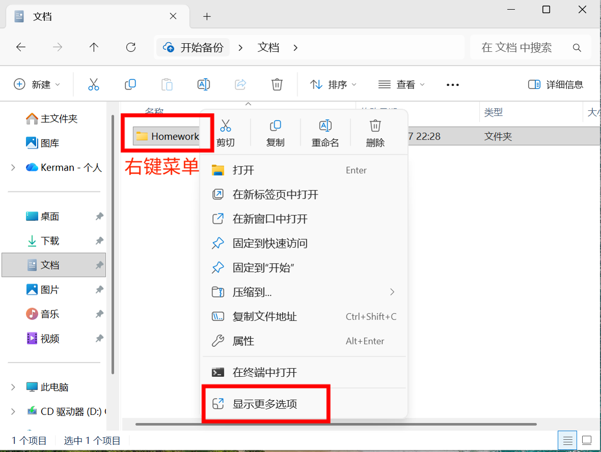
  <div mr--24 />
  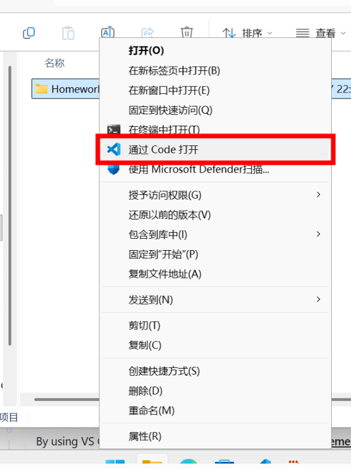
  </div>


---

# 如何打开一个文件夹/工作区？

<div />

<div grid grid-cols-2 gap-12 mx--4>
<div>

B. 在菜单中选择“文件” -> “打开文件夹...”
  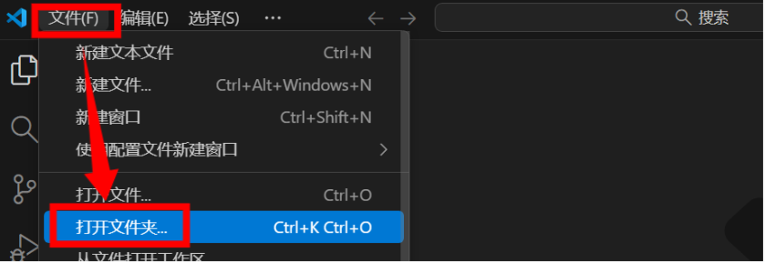

<div h-12 />

D. 在终端中使用 `code .` 命令

<div ml-6 op-60>

(也可能是 `cursor .`)

</div>

</div>
<div>

C. 在欢迎页面的最近列表中选择
  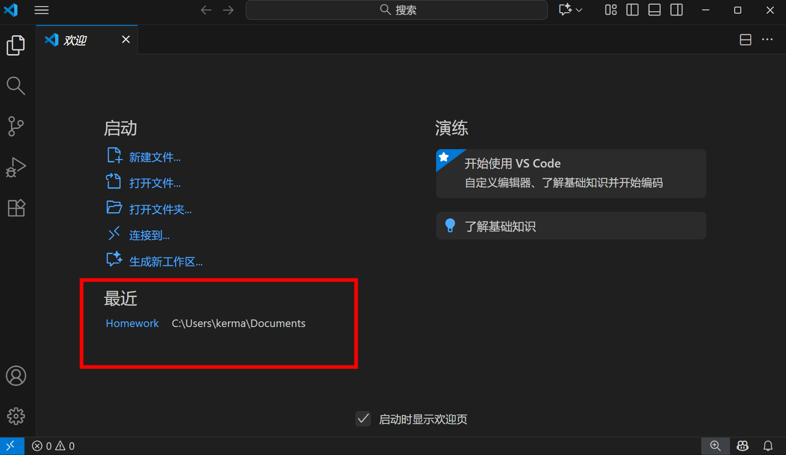

</div>
</div>


<!--
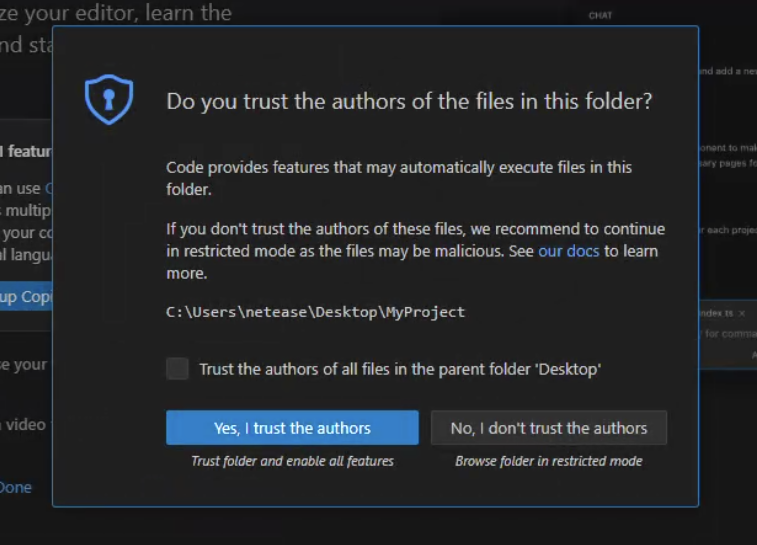


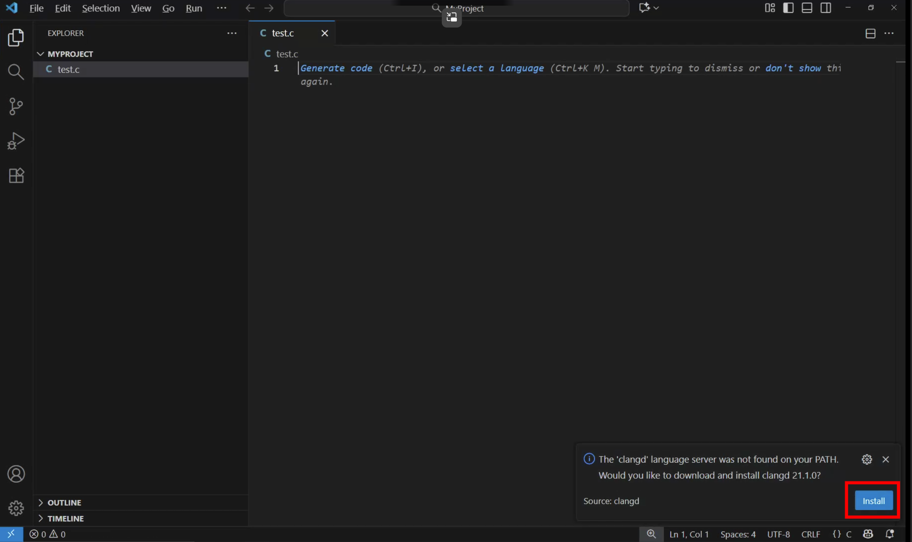
-->

---

# VS Code Features

- **命令面板**: <kbd>Ctrl+Shift+P</kbd> or <kbd>F1</kbd>
  - 几乎所有功能都可以通过命令面板访问
    - 重新加载窗口 / "Reload Window"
    - 切换开关自动保存 / "Toggle Auto Save"


- **终端面板**: <kbd>Ctrl+`</kbd>
  - 自动切换到当前工作目录
  - 支持多终端会话

---

# VS Code Features

- **跳转进入**: <kbd>Ctrl+左键单击</kbd>
  - 跳转到定义、声明等位置
  - <kbd translate-y--1 inline-block>Alt+<carbon-arrow-left /></kbd> 返回

- **快速打开文件**: <kbd>Ctrl+E</kbd>
  - 输入目标文件名的一部分，快速打开文件

- **多光标编辑**: <kbd>Shift+Alt+Down</kbd> / <kbd>Shift+Alt+Up</kbd> / <kbd>Alt+点击</kbd> / <kbd>Ctrl+D</kbd>
  - 在当前行下方/上方插入光标
  - 支持同时编辑多个位置

---

# VS Code Remote

<div />

VS Code 支持 “前后端分离”，这使得它可以成为访问远程环境的强大工具

- **WSL** &nbsp;-&nbsp; 在 Windows 上无缝访问 Linux 子系统
- **Tunnels** &nbsp;-&nbsp; 从任何地方访问任何设备的 VS Code
- **SSH** &nbsp;-&nbsp; 通过 SSH 连接到远程服务器
- **VS Code Server** &nbsp;-&nbsp; 通过浏览器连接到 VS Code 实例
- **vscode.dev / github.dev** &nbsp;-&nbsp; 在线版（无后端）VS Code
- **GitHub Codespaces** &nbsp;-&nbsp; 基于云的开发环境

<div h-4 />

- **Live Share / [P2P Live Share](https://github.com/kermanx/p2p-live-share)**: 实时协作编辑

---

# 拓展推荐

- **Catppuccin Icons** &nbsp;-&nbsp; 一组美观的图标主题
- **GitLens** &nbsp;-&nbsp; 强大的 Git 扩展，提供丰富的版本控制功能
- **Code Spell Checker** &nbsp;-&nbsp; 代码拼写检查工具
- **CodeSnap** &nbsp;-&nbsp; 代码截图工具
- **File Nesting Updater** &nbsp;-&nbsp; 文件嵌套更新工具
- **vscode-pdf** & **Office Viewer** &nbsp;-&nbsp; PDF 和 Office 文件查看器
- **Live Share** & **P2P Live Share** &nbsp;-&nbsp; 实时协作编辑工具
- 欢迎大家补充！

---

# 开发的“反馈循环”

<div flex gap-8 mr-8 mt--12>
<div mt-16>


</div>

<div flex-grow pt-20 flex justify-between>

<div>
  <carbon-arrow-left text-2xl /><br>
  IDE 中开发流程
  <div op-80 text-sm>
  实时<br>
  语法错误提示<br>
  提示、补全、跳转<br>
  代码重构、格式化<br>
  </div>

  <div flex gap-2 mt-4>
    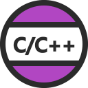
    
  </div>
</div>

<div text-right>
  <carbon-arrow-right text-2xl/><br>
  编译运行流程
  <div op-80 text-sm>
  非实时<br>
  检查运行时效果<br>
  断点调试<br>
  性能分析<br>
  </div>

  <div flex gap-2 mt-4 justify-end>
    
    
  </div>
</div>

</div>


</div>

---
layout: section
zoom: 0.6
---

# Part 2: C 语言开发环境配置

---
class: text-center text-2xl text-center flex flex-col justify-center
---

下面有请

妮可vscode交流群群主

iw17

现场演示配置流程

（后面几页是图文版，以备查阅）{.text-sm.op-80.translate-y-16}

---
hide: true
---

<div grid grid-cols-2 gap-x-12 gap-y-4 text-center mb-8>
<div flex gap-4 items-center justify-center font-bold text-2xl>
 Microsoft C/C++
</div>
<div flex gap-4 items-center justify-center font-bold text-2xl>
 clangd
</div>
<div grid-col-span-2 border="b 1px solid #eee" />
<div>

内置调试器

开箱即用

</div>
<div>

代码分析准确性高

响应速度快

需要配置编译选项

</div>
</div>

1. 使用 clangd 来提供快速、准确的语言服务（禁用微软扩展的 IntelliSense）

2. 保留微软 C/C++ 扩展 仅用于提供调试功能

---

## Step 1: 下载 GCC

<div h-4 />

1. 打开 [https://winlibs.com/](https://winlibs.com/)，往下滑动，找到 “Release versions” 部分

2. 下载适合你系统的最新版本的压缩包（一般来选择 Win64, Zip archive）<br>（如遇到网络问题可以 [点击这里](/gcc.zip) 下载）

3. 右键点击压缩包，点击 “全部解压缩”，解压到你想放置的目录（例如 `C:\gcc`）

---

## Step 2: 配置环境变量 (1/2)

1. 在开始菜单搜索 “环境变量”，点击 “编辑系统环境变量”
2. 点击 “环境变量” 按钮
3. 在 “系统变量” 部分，找到 `Path` 变量，并点击 “编辑”

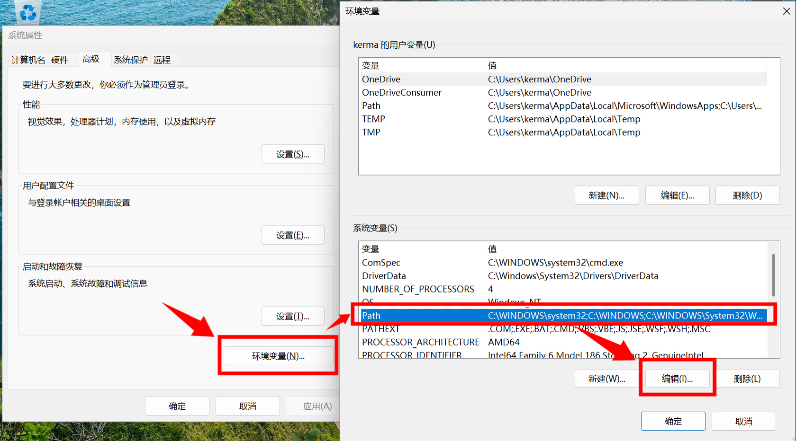{.h-60.ml-2.mt--2}

---

## Step 3: 配置环境变量 (2/2)

4. 点击 “新建”，添加刚才解压的 GCC 目录下的 `mingw64\bin` 文件夹路径<br>[（例如 `C:\gcc\mingw64\bin`）]{.text-sm.mt--1.block}
5. 类似地，添加 `mingw64\x86_64-w64-mingw32\bin` 文件夹路径<br>[（例如 `C:\gcc\mingw64\x86_64-w64-mingw32\bin`）]{.text-sm.mt--1.block}
5. 点击 “确定” 保存修改，关闭所有窗口

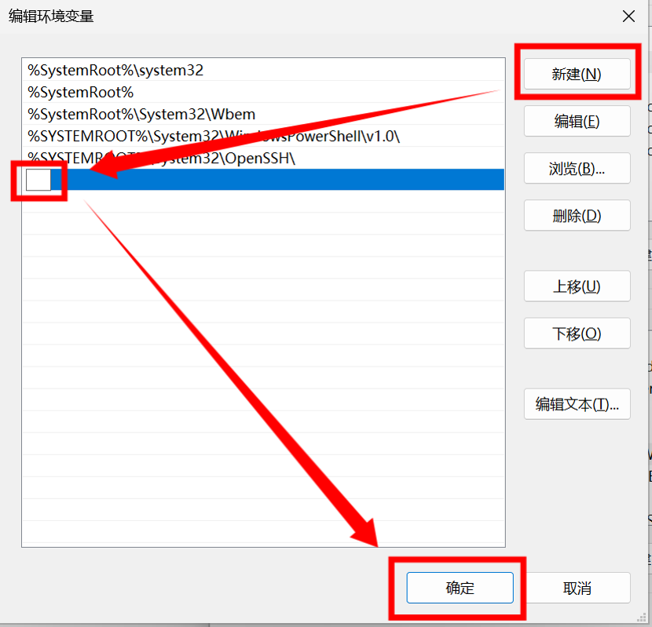{.h-58.ml-2.mt--4}

---

## Step 4: 验证安装（可跳过）

1. 打开命令提示符（Win+R，输入 `cmd`，回车）

2. 输入 `gcc --version` 并回车

3. 如果显示了 GCC 的版本信息，说明安装成功
  
   否则，若出现 “未找到命令” 之类的错误，请检查环境变量配置是否正确

---

## Step 5: 安装 VS Code 扩展

1. 打开 VS Code，点击左侧活动栏中的扩展图标 <codicon-extensions-large />

2. 搜索并安装 C/C++ 扩展 

---

## Step 6: 创建一个 C 语言项目 (1/3)

1. 在合适的地方，创建一个新的文件夹作为项目目录
  <br>（例如桌面上的 `C:\Users\YourUsername\Desktop\CProjects`）
  <br>（不建议包含中文或空格）

2. 右键点击该文件夹，选择 “通过 Code 打开”（详见幻灯片前面部分，也可以用其他方式打开）

3. 在 VS Code 中，创建一个新的文件夹，命名为 `.vscode`

4. 在 `.vscode` 文件夹中，创建一个名为 `launch.json` 的文件

---

## Step 7: 创建一个 C 语言项目 (2/3)

5. 在 `launch.json` 文件中，复制粘贴以下内容：

```json{*}{class:'origin-left-top scale-56'}
{
    "configurations": [
        {
            "name": "(gdb) Launch",
            "type": "cppdbg",
            "request": "launch",
            "program": "${fileDirname}\\${fileBasenameNoExtension}.exe",
            "args": [],
            "stopAtEntry": false,
            "cwd": "${fileDirname}",
            "environment": [],
            "externalConsole": false,
            "MIMode": "gdb",
            "miDebuggerPath": "gdb",
            "setupCommands": [
                {
                    "description": "Enable pretty-printing for gdb",
                    "text": "-enable-pretty-printing",
                    "ignoreFailures": true,
                },
                {
                    "description": "Set Disassembly Flavor to Intel",
                    "text": "-gdb-set disassembly-flavor intel",
                    "ignoreFailures": true,
                },
            ],
            "preLaunchTask": "C/C++: gcc build active file",
        },
    ],
}
```

---

## Step 8: 创建一个 C 语言项目 (3/3)

6. 类似地，在 `.vscode` 文件夹中，创建一个名为 `tasks.json` 的文件，并复制粘贴以下内容：

```json{*}{class:'origin-left-top scale-68'}
{
    "version": "2.0.0",
    "tasks": [
        {
            "type": "shell",
            "label": "C/C++: gcc build active file",
            "command": "gcc",
            "args": [
                "-g",
                "${file}",
                "-o",
                "${fileDirname}\\${fileBasenameNoExtension}.exe"
            ],
            "group": {
                "kind": "build",
                "isDefault": true
            },
            "problemMatcher": ["$gcc"],
            "detail": "Generated task by Debugger."
        }
    ]
}
```

7. 记得保存两个文件

---

## Step 9: 编写并运行第一个 C 程序

1. 在项目根目录下，创建一个名为 `hello.c` 的新文件

2. 在 `hello.c` 中，输入以下代码，并保存：

```c{*}{class:'origin-left-top scale-80 mb--6!'}
#include <stdio.h>

int main() {
    printf("Hello, World!\n");
    return 0;
}
```

3. 按下 <kbd>F5</kbd> 键（或 <kbd>Fn+F5</kbd>），开始调试运行程序

4. 在下方的面板中，应该能够看到调试日志（在调试控制台栏目）和程序输出（在终端栏目）

---

## Caveats

<div />

- C++ 环境配置、其他系统配置可参考 **https://blog.iw17.cc/vscode-c-cpp/**

- 该文件夹下可以放置多个 C/C++ 源文件，按下 <kbd>F5</kbd> 时会编译并运行当前打开的文件

- 编译得到的可执行文件会放在与源文件相同的目录下

---

<div fixed inset-0 flex class="bg-#1B1B1B" px-4>
<div flex-grow text-white pb-12 text-center text-3xl flex flex-col justify-center>

Part 3

自由讨论与答疑

<div text-base mt-12 op-80> 
在线访问幻灯片：
<a href="https://kermanx.com/lug-vscode" target="_blank" rel="noopener noreferrer" class="text-white-400! border-none!">
https://kermanx.com/slides-vscode-c
</a>
</div>

</div>


</div>

<div fixed right-0 bottom-0 h-20 w-120 class="bg-#1B1B1B" />
